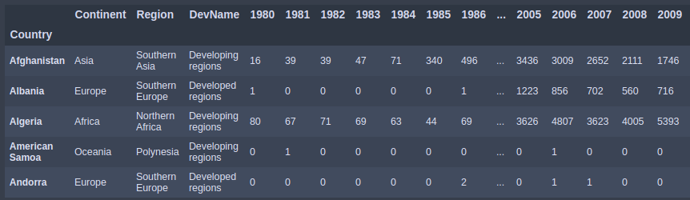
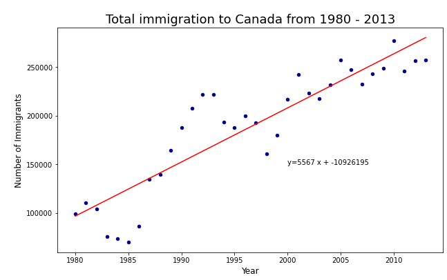
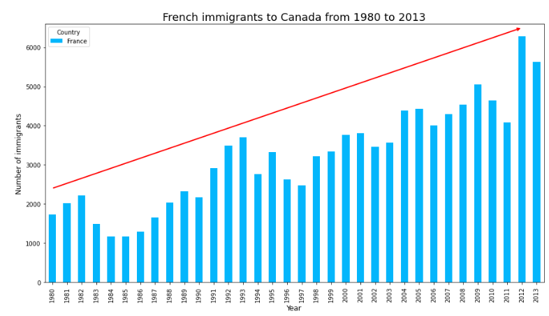
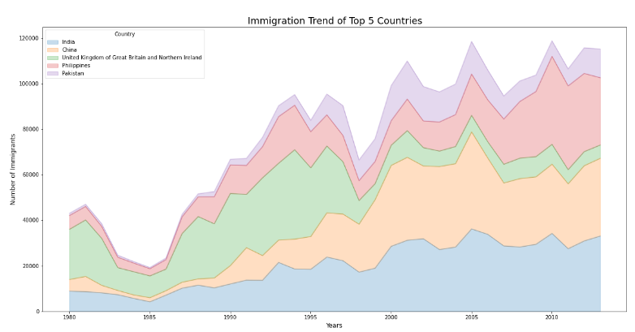
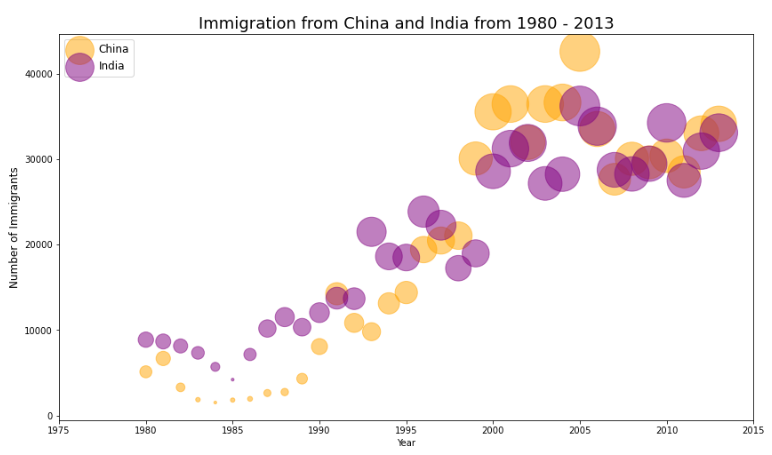
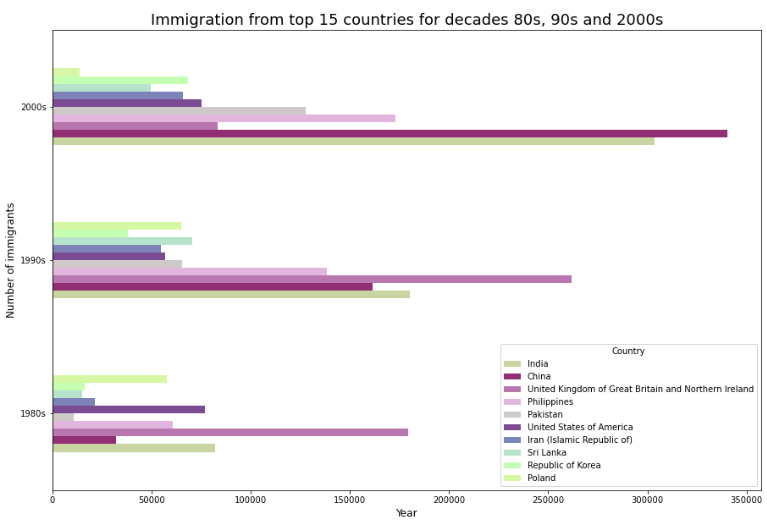
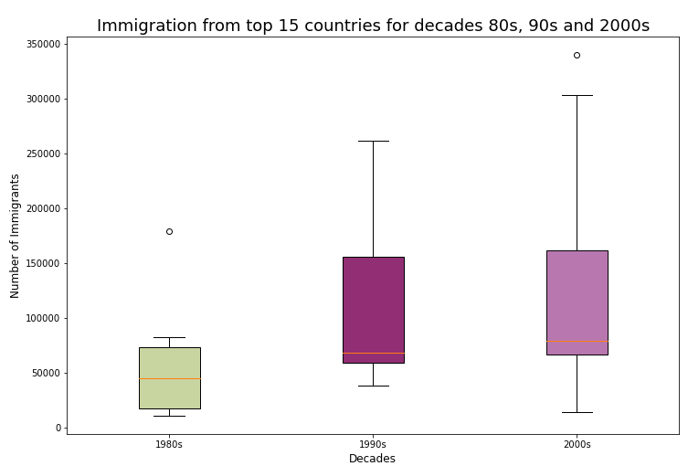
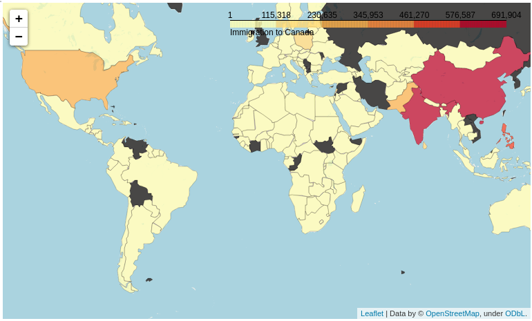

# Immigration to Canada from 1980 to 2013

## Table of Contents

1. [Data Wrangling](#data_wrangling)
    1. [Identify missing values](#missing_v)
    2. [Drop unnecessary data](#drop_data)
2. [Exploratory Data Analysis](#exploratory_da)
    1. [Total Immigration Canada](#total_immigration)
    2. [Immigration to Canada from France](#immigration_france)
    3. [Immigration trend of Top 5 countries](#immigration_top5)
    4. [Immigration trend of Top 2 : China & India](#immigration_ci)
    5. [Immigration trend of Top 10 countries by decades](#immigration_decades)
3. [Geospatial Analysis - Choropleth Map](#geospatial_analysis)
4. [Word Cloud - Maple Leaf](#ml_word_cloud)

## Extract of the dataset

## Snapshots of the study

## Link to Kaggle Notebook
Kaggle Notebook : <https://www.kaggle.com/franmore/immigration-to-canada-eda-and-visualization>
